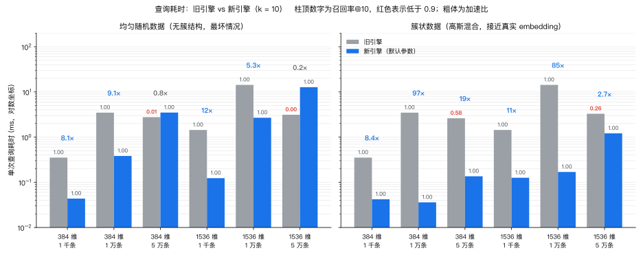
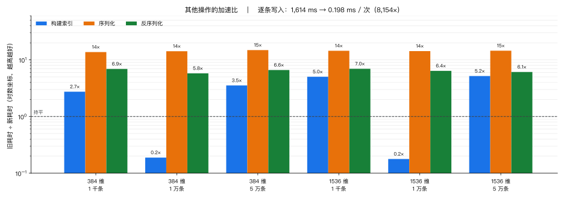
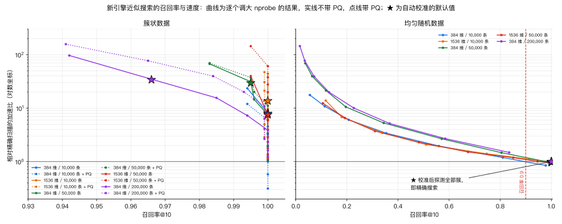

<div align="center">

# @chatluna/luna-vdb

_轻量级，本地的 Wasm 向量数据库。_

## [](https://www.npmjs.com/package/@chatluna/luna-vdb) [](https://www.npmjs.com/package/@chatluna/luna-vdb)  

</div>

## 特性

- Rust + WebAssembly，Node.js 与浏览器通用，附带 TypeScript 类型。
- **默认近似搜索，召回率经过校准**：向量数达到 4096 后自动建立 IVF 索引。每次训练完，索引会拿库里已有的向量做留一法测试，选出让召回率@10 达到 0.95 所需的最少探测簇数（至少 2 个）。数据有簇结构时（真实 embedding 通常如此），每次查询只需扫描很少的簇；数据没有结构、探测几乎省不了什么时，会自动改为精确搜索。
- **需要时可以精确**：`approximate: false` 时返回真正的 k 近邻，此时 IVF 簇只用来剪枝；`searchExact` 始终做暴力扫描。
- 可选乘积量化 (PQ) 预筛选。如果它达不到召回率目标，校准时会自动停用。
- 手写 SIMD 内核：wasm SIMD128，原生构建另有 AVX2 / NEON；同时发布不含 SIMD 的标量构建。
- 增删批量操作是原子的：一批里任何一条出错，整批都不生效。
- 出错抛出真正的 `Error` / `TypeError`，实例在出错后仍然可用。
- 快照格式带 CRC-32 校验和 LZ4 压缩，损坏或伪造的数据只会抛错，不会崩溃或耗尽内存；可以直接读取 0.0.x 写出的旧快照。

## 安装

```bash
yarn add @chatluna/luna-vdb
# 或
npm install @chatluna/luna-vdb
```

## 快速开始

### Node.js

Node.js 下无需初始化，CommonJS 和 ESM 均可：

```ts
import { LunaVDB } from '@chatluna/luna-vdb'
// const { LunaVDB } = require('@chatluna/luna-vdb')

const db = new LunaVDB({ distance: 'cosine' })

db.add({
    embeddings: [
        { id: 'cat', embeddings: [0.8, 0.7, 0.6] },
        { id: 'dog', embeddings: [0.4, 0.3, 0.2] },
        { id: 'bird', embeddings: [0.2, 0.1, 0.9] }
    ]
})

const { neighbors } = db.search(new Float32Array([0.75, 0.65, 0.55]), 2)
for (const { id, distance } of neighbors) {
    console.log(id, distance)
}

db.remove(['dog'])

// 持久化
const bytes = db.serialize() // Uint8Array
const restored = LunaVDB.deserialize(bytes)
console.log(restored.size()) // 2

// wasm 内存不归 JS 垃圾回收直接管理，用完尽早释放
db.free()
restored.free()
```

### 浏览器

浏览器入口需要先 `await init()` 加载 `.wasm`：

```ts
import init, { LunaVDB } from '@chatluna/luna-vdb'

await init()

const db = new LunaVDB()
```

`init()` 通过 `new URL('luna_vdb_bg.wasm', import.meta.url)` 定位 `.wasm` 文件，Vite 和 webpack 5 会自动把它作为资源打包。使用 Vite 开发服务器时，需要把本包排除在依赖预构建之外，否则这个相对路径会失效：

```ts
// vite.config.ts
export default {
    optimizeDeps: { exclude: ['@chatluna/luna-vdb'] }
}
```

也可以手动传入 `.wasm` 的地址或字节：

```ts
import init from '@chatluna/luna-vdb'
import wasmUrl from '@chatluna/luna-vdb/pkg/web/luna_vdb_bg.wasm?url'

await init({ module_or_path: wasmUrl })
```

### 不支持 SIMD 的运行时

默认构建使用 wasm SIMD128（Node.js 18+、Chrome 91+、Firefox 89+、Safari 16.4+ 均支持）。缺少 SIMD128 的运行时会在**实例化时**直接失败，这种情况下请改用标量构建，API 完全相同：

```ts
import { LunaVDB } from '@chatluna/luna-vdb/scalar'
```

用 `simdBackend()` 可以确认当前加载的是哪个构建（`'wasm-simd128'` 或 `'scalar'`）。

## API

### `new LunaVDB(options?)`

| 选项               | 类型      | 默认值        | 说明                                                              |
| ------------------ | --------- | ------------- | ----------------------------------------------------------------- |
| `distance`         | `string`  | `'euclidean'` | `'euclidean'` / `'cosine'` / `'dot'`                              |
| `approximate`      | `boolean` | `true`        | `false` 时改为精确搜索                                            |
| `nprobe`           | `number`  | 自动校准      | 近似模式下每次查询探测的簇数；手动指定后不再自动校准              |
| `nlist`            | `number`  | `√n`          | IVF 簇数                                                          |
| `ivfThreshold`     | `number`  | `4096`        | 向量数达到该值后建立 IVF 索引                                     |
| `exactRescoreOnly` | `boolean` | `true`        | 设为 `false` 时额外训练 PQ，仅在近似模式下使用                    |
| `pqM`              | `number`  | 自动          | PQ 子空间数                                                       |
| `pqKsub`           | `number`  | 自动          | 每个子空间的码字数，最大 256                                      |

为兼容 0.0.x，构造函数也接受 `{ embeddings }`，效果等同于 `new LunaVDB()` 之后调用 `index()`。

### 写入

- `index({ embeddings })`：用这一批向量替换全部内容。
- `add({ embeddings })`：追加一批向量。ID 重复、维度不一致、含 `NaN` / `Infinity` 或空向量时抛错，整批都不写入。
- `remove(ids)`：删除一组 ID。任何一个 ID 不存在就抛错，一个都不删。
- `clear()`：清空。
- `compact()`：立即回收已删除向量占用的空间。通常会自动进行，无需手动调用。

### 查询

- `search(query, k)`：返回 `{ neighbors, scanned, rescored, cellsProbed, exact }`。`neighbors` 按距离从近到远排列；`exact` 表示这次的结果是否是精确结果；`k` 大于向量总数时返回全部向量；`query` 含 `NaN` / `Infinity` 时抛出 `TypeError`。校准针对 `k ≤ 10`，`k` 更大时探测的簇数按 `√(k/10)` 增加。
- `searchExact(query, k)`：忽略索引的暴力搜索，总是返回精确结果。
- `size()`、`dimension()`、`distance()`、`has(id)`、`stats()`、`hasSimd()`。

`distance` 的含义：

- `euclidean`：欧氏距离（开过平方根）。
- `cosine`：`1 - cos θ`，范围 `[0, 2]`。
- `dot`：点积本身，越大越近，结果按点积从大到小排列。

### 序列化

- `serialize(compressed = true)`：返回 `Uint8Array`。数据只在同一进程里立刻恢复时，可以传 `false` 跳过 LZ4 压缩。
- `LunaVDB.deserialize(bytes, options?)`：`bytes` 可以是 `Uint8Array`（包括 Node.js 的 `Buffer`）或 `ArrayBuffer`。距离度量总是取自快照；`options` 只能覆盖 `nprobe`、`approximate` 这类查询期参数。
- `restoreInto(bytes)`：恢复到当前实例。失败时原有内容保持不变。
- `isSnapshot(bytes)`、`snapshotVersion(bytes)`：只读取文件头，判断数据是否为可读取的快照。
- `version()`、`simdBackend()`。

## 从 0.0.x 升级

- 1.0 能读取 0.0.x 写出的快照（旧索引会被丢弃并重新训练），但 **0.0.x 读不了 1.0 写出的快照**，请不要在升级后再降级。
- 以前会让 wasm 崩溃（`RuntimeError: unreachable`，或后续调用里莫名其妙的空指针错误）的情况，现在都会抛出普通的 `Error` / `TypeError`，实例还能继续使用。
- 写入时会拒绝含 `NaN` / `Infinity` 的向量和空向量。
- `search` 的结果里多了 `scanned`、`rescored`、`cellsProbed`、`exact` 几个字段，`neighbors` 的格式没变。
- 4096 条以上默认是近似搜索（召回率@10 校准到 0.95）。必须拿到精确结果时，请传 `approximate: false`，或者调用 `searchExact`。

## 性能

以下数据来自 GitHub Actions 的 `ubuntu-latest` 机器（AVX2，单线程，**原生构建**），对比对象是重写前的引擎（提交 `ca10590`）。wasm 构建只有 128 位 SIMD，绝对耗时会更长，但新旧引擎之间的相对差距大致相同。查询都用默认参数，k = 10，取 100 次查询的平均值；召回率是相对精确结果计算的。

测试用了两种数据。均匀随机数据没有任何簇结构，是所有分区索引的最坏情况。簇状数据是互相有重叠的高斯混合分布，更接近真实的 embedding。



- **1 万条的簇状数据上，相同召回率（1.00）下查询快 85–97 倍。**
- **均匀数据上快 5–12 倍。** 这种数据靠索引省不下多少扫描，新引擎会自动改为精确扫描，速度来自 SIMD 和更紧凑的内存布局。
- **5 万条时旧引擎并不比新引擎快。** 旧引擎在 2 万条以上启用的 IVF 实现有缺陷，召回率只有 0.001–0.58，返回的结果大多是错的；新引擎在这一档的召回率是 0.996–1.000。



- **逐条写入快约 8 000 倍**：在 25 000 条、384 维的库上逐条 `add`，旧引擎每次都重建整个索引。
- **1 万条时构建慢约 5 倍**（384 维时 31 → 166 ms）。旧引擎在这个规模不建索引；新引擎要训练 IVF 并校准 `nprobe`，上面的查询速度就是这样换来的。
- 快照体积比旧格式大约 10%。



这张图把新引擎的近似搜索与它自己的精确扫描作对比：每条曲线逐个调大 `nprobe`，★ 是自动校准选出的默认值。在簇状数据上，校准结果都是 2 个簇，比精确扫描快 7.5–34 倍，召回率 0.966–1.000；开启 PQ（`exactRescoreOnly: false`）后快 6–78 倍。在均匀数据上，想达到召回率目标就得扫描大部分数据，所以校准结果是探测全部簇，也就是精确搜索；PQ 在这种数据上达不到目标，会被自动停用。

图表由 `scripts/charts.py` 根据 CI 的 `compare-results` 产物生成：

```bash
gh run download <run-id> -n compare-results -D /tmp/compare
uv run scripts/charts.py /tmp/compare/compare.txt
```

## 开发

```bash
yarn build          # 构建 pkg/{web,nodejs,web-scalar,nodejs-scalar}
yarn test           # 原生测试 + JS 冒烟测试
yarn test:wasm      # wasm-bindgen-test（Node.js 与 headless Chrome）
yarn bench          # 原生基准测试
```

构建需要 Rust 1.90、`wasm32-unknown-unknown` target 和 `wasm-bindgen-cli`（版本必须与 `Cargo.lock` 中的 `wasm-bindgen` 完全一致，目前是 0.2.129）；`wasm-opt`（binaryen）可选。`yarn remote:test`、`yarn remote:wasm` 等脚本会把代码同步到远程主机，在 Docker 中构建和测试。

## 致谢

- [tinyvector](https://github.com/m1guelpf/tinyvector)，最初的实现参考了它。
